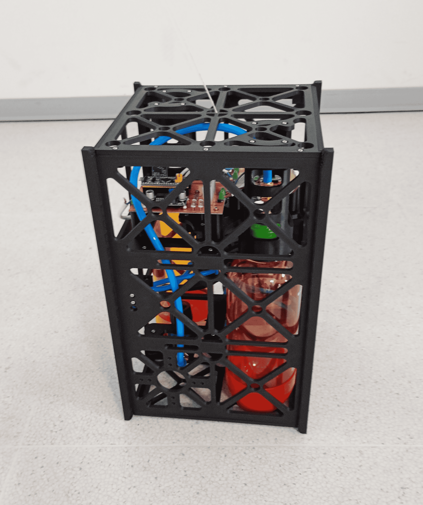
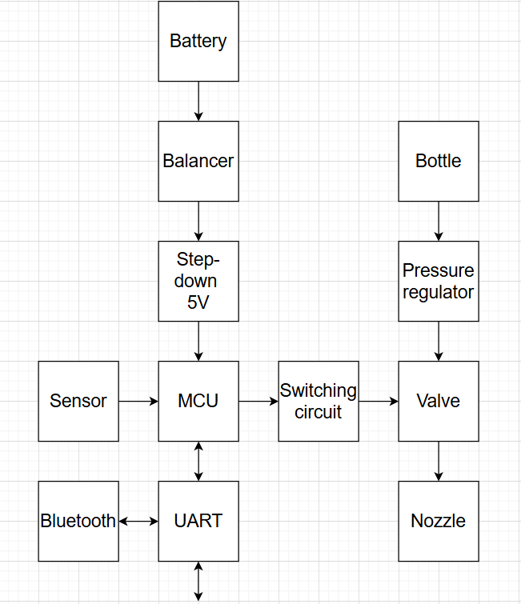

# Jet ADCS with Siphon Cartridge

Experimental Attitude Determination and Control System (ADCS) for CubeSats using a reaction-based pneumatic propulsion system (RPPS).

---

Team members

1. Vít Charvátek (responsible for Pneumatics)
2. Vít Janoš (responsible for Electronics)
4. Antonín Putala (responsible for Software, Structure)

> [!WARNING]
> May 5 will be final presentation.

## 1. Project Overview
The **Jet ADCS with Siphon Cartridge** is an engineering project focused on the design and implementation of a single-axis orientation control system for nanosatellites (CubeSats). While traditional CubeSats rely on reaction wheels or magnetorquers, this project explores the use of compressed air to generate torque.

 

### Core Concept
The system uses a compressed air as a propellant source. By regulating the pressure and precisely timing the opening of solenoid valves, the system can produce controlled thrust through two nozzles. This thrust creates a mechanical moment that allows the satellite to rotate to a desired angular position or maintain stability.

## Requirements
1.	Operation on battery supply
2.	Wireless control capability
2.  Attitude determination using an onboard sensor
2.  Actuation using compressed air
2.	Analysis of the pulse response of the system
2.  Maintaining a stable orientation around a single axis
2.	Performing controlled orientation changes

### Conceptual Scheme
The operational logic follows this flow:
1. **Sensing:** The IMU tracks the current orientation and angular velocity.
2. **Processing:** The STM32 microcontroller calculates the error between the desired and current state via a PID algorithm.
3. **Actuation:** Solenoid valves release precise bursts of air through nozzles to correct the orientation.
4. **Monitoring:** Data is sent wirelessly via Bluetooth to a ground station for real-time analysis.

---

## 2. Electronics
The electronics subsystem provides the "intelligence" and power management for the device.
* **Control Unit:** STM32 "Blue Pill" (ARM Cortex-M3) managing high-speed PID loops and valve timing.
* **Sensors:** MPU9250 (9-axis IMU) providing high-precision data via SPI.
* **Communication:** HC-05 Bluetooth module for wireless telemetry and command uplink.
* **Power:** 3x Li-ion 18650 cells with an integrated BMS (Battery Management System) and a DC/DC converter for a stable 5V rail.

---

## 3. Pneumatics
The propulsion system is designed for reliability and simplicity under terrestrial testing conditions.
* **Propellant:** Standard SodaStream bottle with compressed air.
* **Regulation:** AR2000 pressure regulator to step down high cartridge pressure to a constant operational level.
* **Actuators:** Two 2V025-08 electromagnetic solenoid valves.

---

## 4. Structure
The mechanical frame follows the CubeSat form factor philosophy, optimized for a single-axis testbed.
* **Frame:** 12U-inspired vertical structure manufactured using PETG filament on a 3D printer.
* **Assembly:** Secured with M2.5 threaded heat-set inserts for high durability and repeatable maintenance.
* **Balancing:** Adjustable mounts for internal components to align the center of mass with the rotation axis.

---

## 5. Software
The firmware is written in C, focusing on low latency and deterministic control.
* **Control Loop:** A PID (Proportional-Integral-Derivative) controller tuned for the specific moment of inertia of the 1.9kg assembly.
* **Data Fusion:** Complementary filtering of accelerometer and gyroscope data from the MPU9250.
* **Interface:** Custom serial protocol over Bluetooth for real-time gain adjustment and state monitoring.

---

## Task list
- [ ] System
   * [x] Conceptual diagram
   * [x] Requirements
   * [ ] Energy budget
   * [x] Component list
   * [x] Component purchase
   * [x] Physical description
   * [ ] Report
- [x]  Electronics
   * [x] Component choice 
      - [x] Battery
      - [x] Step-down
      - [x] Accelerometer
   * [x] Circuit design
      - [x] LED indicator
      - [x] Switching circuit
   * [x] PCB design
   * [x] Soldering
- [x]  Pneumatics
   * [x] Component choice 
      - [x] Valve
      - [x] T-hub
      - [x] Tube
   * [x]  Gas bottle construction
   * [x]  Completation pneumatic circuit
   * [x]  Sealing
   * [x]  Nozzles
- [x] Software
   * [x] Component choice 
       - [x] MCU
       - [x] Wireless module
   * [x] UART communication
       - [x] Sensor data
       - [x] Valve control
           * [x] Position setting
           * [x] Position regulation
       - [x] Command implementation
   * [x] Wireless communication
   * [x] Constant tuning
   * [x] Testing
   * [x] Doxygen
- [x] Structure
   * [x] Size estimation
   * [x] Structural design
   * [x] 3D print
   * [x] Assembly
     
---

## Documents
- [Part list](https://vutbr-my.sharepoint.com/:x:/r/personal/246858_vutbr_cz/Documents/MPA-NDE%20Part%20List.xlsx?d=wf46451cfd72a41359eeacaa9987770c3&csf=1&web=1&e=Fm6BbQ)
- [Presentation 1](https://vutbr-my.sharepoint.com/:p:/r/personal/246850_vutbr_cz/_layouts/15/Doc.aspx?sourcedoc=%7BA22FE4DB-148C-41C8-9C42-CBA38E74E679%7D&file=Prezentace_1.pptx&fromShare=true&action=edit&mobileredirect=true)
- [Presentation 2](https://vutbr-my.sharepoint.com/:p:/r/personal/246922_vutbr_cz/_layouts/15/Doc.aspx?sourcedoc=%7B1F2A7DCB-3A78-4C2B-ABEC-51CC65FE5E03%7D&file=Prezentace_2.pptx&action=edit&mobileredirect=true)
- [Presentation 3](https://vutbr-my.sharepoint.com/:p:/r/personal/246922_vutbr_cz/_layouts/15/Doc.aspx?sourcedoc=%7Bb8d8ee2d-dea4-4bd7-80e0-b8eedcd8eff3%7D&action=edit&wdPreviousSession=f2da6c50-2410-d63b-7747-ba218f665f97)
- [Presentation 4](https://vutbr-my.sharepoint.com/:p:/r/personal/246922_vutbr_cz/_layouts/15/Doc.aspx?sourcedoc=%7Bfdc04afe-ad7c-41b7-ba45-5333d5b4e1ec%7D&action=edit&wdPreviousSession=a0a396ff-f194-bd80-6fab-eeac188b319b)
- [Presentation 5](https://vutbr-my.sharepoint.com/:p:/r/personal/246922_vutbr_cz/_layouts/15/Doc.aspx?sourcedoc=%7B985cec3f-7b48-4ae2-b9dc-034aea59f2ab%7D&action=edit&wdPreviousSession=30f991b1-2b14-5247-71b9-fc82ac9b66c8)
- [Programming documantation](https://raw.githack.com/CharvatekVit/MPA-NDE/main/Documentation/html/index.html)
- [Documentation](https://vutbr-my.sharepoint.com/:f:/g/personal/246922_vutbr_cz/IgBKQASchL7PSJfr07Y2DRViAZgop-J1y6nprSuAsayNgWo?e=VgrZa8)

## 6. Bibliography

[1] -, Space-Based Astronomy Operations. Online. 2026 NASA. [cit. 2026-04-10]. Available from: https://www.nasa.gov/missions/space-based-astronomy-operations/

[2] -, CubeSat Design Specification Rev. 14.1 . Online. 2026 The CubeSat Program, Cal Poly SLO. [cit. 2026-04-10]. Available from: https://www.cubesat.org/resources

[3] -, Attitude Determination and Control System (ADCS) . Online. 2026 CubeSatShop. [cit. 2026-04-11]. Available from: https://www.cubesatshop.com/product-category/adcs/

[4] -, PETG: Material safety data sheet . Online. 2026 Prusa 3D. [cit. 2026-04-12]. Available from: https://www.prusa3d.com/downloads/materials/msds/Prusament_PETG_MSDS.pdf

[5] -, Heat Set Inserts . Online. 2026 Prusa 3D. [cit. 2026-04-12]. Available from: https://www.prusa3d.com/product/threaded-inserts-m2-5-standard-100-pcs/

[6] -, Solenoid Valve Specifications and Dimensions: 2V025 & 2V035 Series . Online. 2026 STC valve. [cit. 2026-04-18]. Available from: https://www.stcvalve.com/Solenoid_Valve_Specification_2V025.htm

[7] -, Regulátor tlaku s manometrem 1/4 palce AR2000 . Online. 2026 HP Control. [cit. 2026-04-18]. Available from: https://hpcontrol.cz/reduktor-regulator-1-4-cala-manometr-ar2000.html

[8] -, mpu9250 . Online. 2026 Libdriver. [cit. 2026-04-23]. Available from: https://github.com/libdriver/mpu9250

[9] Khaled Magdy, STM32 Blue Pill Pinout & Programming Guide . Online. 2026 DeepBlue Embedded. [cit. 2026-04-26]. Available from: https://deepbluembedded.com/stm32-blue-pill-pinout-programming-guide/
